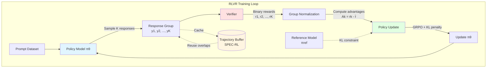
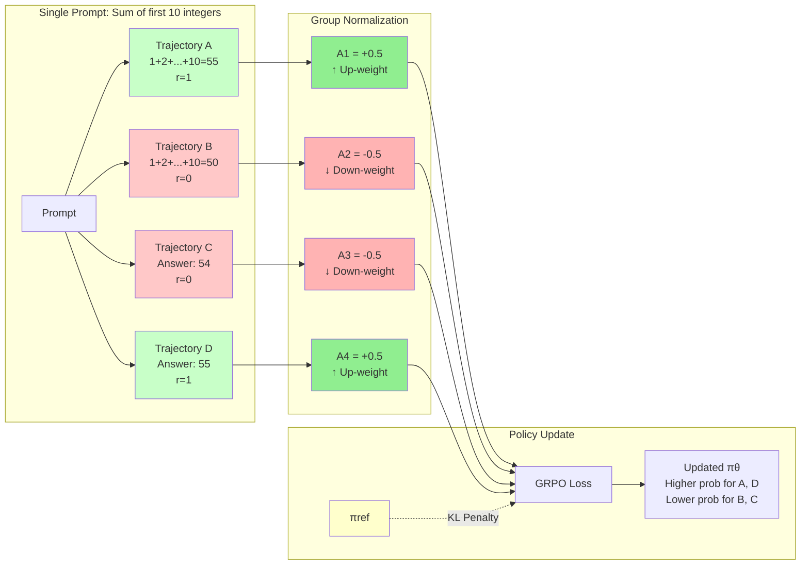

## Key takeaways

- RLVR is just RL with a special kind of reward: a program or model that can verify correctness for each sample, often as a binary score.

## Motivation

For the past few years, "alignment" has largely meant "making models helpful and harmless according to human raters." We train reward models to mimic human preferences, then use Reinforcement Learning from Human Feedback (RLHF) to optimize for those scores. It works, but it has a ceiling: models can only get as good as the humans rating them, and they often learn to "hack" the reward by sounding confident rather than being correct.

**Reinforcement Learning with Verified Rewards (RLVR)** represents a shift toward *objective* alignment. Instead of asking "Does this look good?", we ask "Does this pass the test?"

In domains like math, coding, and logical reasoning, we don't need a fuzzy reward model; we can run the code, check the proof, or verify the answer. If we can define a test, we can let the model explore, fail, and learn from its own mistakes—potentially surpassing human performance.

This post is a guide to the RLVR landscape for researchers and practitioners. We will:

1.  **Deconstruct the core RLVR loop**, showing how it simplifies standard RL by replacing learned reward models with deterministic verifiers.
2.  **Walk through a toy example** to build intuition for how group-based policy gradients (like GRPO) shape reasoning.
3.  **Survey the state of the art**, from open-weight models like Tulu 3 to new frontiers in vision and world models.
4.  **Dive into the engineering challenges**, specifically sampling efficiency and the subtle art of designing robust verifiers.

## Recap of post-training

Before diving into RLVR, let's briefly recap the standard post-training pipeline for LLMs.

1.  **Pre-training**: The model learns to predict the next token on massive text corpora. It learns "what comes next" but not necessarily how to follow instructions.
2.  **Supervised Fine-Tuning (SFT)**: The model is trained on high-quality instruction-response pairs. It learns the *format* of helpful assistance.
3.  **Preference Alignment (RLHF/DPO)**: The model is trained to prefer responses that humans rate higher. This aligns the model's "vibes" with human values (helpfulness, safety).

RLVR fits into this third stage, but for tasks where "vibes" are replaced by "truth."

## From RLHF to RLVR

### The shift: Verifier instead of Reward Model

In RLHF, the reward comes from a learned model (the Reward Model or RM) that approximates human preference.
In RLVR, the reward comes from a **Verifier**—a function that executes a test.

| Feature | RLHF (Standard) | RLVR |
| :--- | :--- | :--- |
| **Reward Source** | Learned Neural Network (RM) | Deterministic Program / Verifier |
| **Signal** | Soft, continuous scalar | Hard, binary (Pass/Fail) |
| **Ground Truth** | Subjective (Human Preference) | Objective (Unit Test, Math Proof) |
| **Risk** | Reward Hacking (Optimizing for high RM score) | Overfitting to the specific test |

Tulu 3 popularised the term RLVR in open language model post-training, showing gains on mathematical problem solving and instruction following by combining supervised fine-tuning, DPO, and RLVR. <d-cite key="tulu3_open_instruct"></d-cite>


## The core RLVR loop

The most common RLVR implementation today uses **GRPO (Group Relative Policy Optimization)** <d-cite key="grpo2025"></d-cite>. Unlike PPO, which requires a separate value network (critic) to estimate the baseline, GRPO estimates the baseline from the group of sampled outputs itself. This reduces memory usage and simplifies the training loop.

**High-level loop**

For each prompt $x$:

1. Sample a *group* of $K$ responses $(y_1, \dots, y_K)$ from the current policy.
2. For each response, compute a verifier reward $r_k \in \{0,1\}$ or a small set of discrete values.
3. Normalise rewards within the group to compute an advantage for each sample.
4. Update the policy using a clipped objective similar to PPO, plus a KL penalty that keeps the policy near a reference model.

  The grouping step is crucial. Within a group, "better than peers" is more important than absolute reward. This stabilises training when rewards are sparse.
  
```text
Algorithm 1: RLVR with GRPO (per batch)
for each prompt x in a batch do
  sample K responses {y₁, …, y_K} ~ π_θ(· | x)
  for k = 1 … K do
    r_k ← verifier(x, y_k)          # binary or discrete reward
  end for
  compute group-normalised advantages {A_k} from {r_k}
  take a policy gradient step on:
      L(θ) = E_k [A_k · log π_θ(y_k | x)] − λ · KL(π_θ(· | x) || π_ref(· | x))
end for
```

In many math and code systems, the verifier only looks at the final answer, so every token in a trajectory shares the same reward. This sequence-level, often binary signal is simple but surprisingly effective: it lets the model learn from both successes and failures, pushes entire reasoning chains toward correct end states, and keeps optimisation directly tied to task-defined correctness.

To mirror the structure of the sample distill post, Figure 1 below condenses the sampler -> verifier -> policy update loop plus a replay buffer for SPEC-RL style reuse.



  **Figure 1.** Overview of the RLVR loop with a reusable trajectory cache. The policy samples responses, the verifier scores them, rewards are normalized within groups to compute advantages, and the policy is updated with GRPO while maintaining a KL penalty to a reference model. SPEC-RL style caching enables trajectory reuse across epochs.
  
  The interactive explorer below mirrors this diagram but is not required to follow the rest of the post; if it does not load in your browser, you can safely skip it.
  
  <div class="l-page">
  <iframe
    src="{{ 'assets/html/2026-04-27-teaching-models-with-tests/policy-trajectory.html' | relative_url }}"
    frameborder="0"
    scrolling="no"
    height="500px"
    width="100%"
  ></iframe>
</div>


## A worked toy example: RLVR for a single math problem

Let us walk through a tiny example that captures the mechanics without any code. If your browser supports it, you can also play with a small interactive version; otherwise you can ignore the iframe below and just follow the text.

Consider the prompt:

> "Compute the sum of the first 10 positive integers. Think step by step and answer with a number at the end."
>

The reference answer is 55, and the verifier simply parses the last number in the output and checks whether it equals 55.

Suppose the current policy samples four trajectories A–D for this prompt whose final answers are $[55, 50, 54, 55]$. The verifier assigns binary rewards

- $r = [1, 0, 0, 1]$,

so the group mean is $\bar{r} = 0.5$ and the group-normalised advantages are

- $A_k = r_k - \bar{r}$, giving $A = [+0.5, -0.5, -0.5, +0.5]$.

GRPO then uses these advantages to increase the log-probabilities of trajectories A and D, decrease those of B and C, and adds a KL penalty that keeps $\pi_\theta$ close to a frozen reference policy $\pi_{\text{ref}}$. Over many prompts and groups, this shifts probability mass toward reasoning paths that end in correct answers according to the verifier.



**Figure 2.** Token-level view of GRPO for a single prompt. Four trajectories are sampled with different rewards (1 for correct, 0 for incorrect). Group normalization computes advantages relative to the mean reward (0.5), resulting in positive advantages for correct answers and negative for incorrect ones. The policy update increases probability for trajectories A and D while decreasing it for B and C, with a KL penalty keeping the policy close to the reference model.

<div class="l-page">
  <iframe
    src="{{ 'assets/html/2026-04-27-teaching-models-with-tests/toy-example.html' | relative_url }}"
    frameborder="0"
    scrolling="no"
    height="380px"
    width="100%"
  ></iframe>
</div>

This is all RLVR does at its core. Everything else in recent papers adjusts:

- How you sample groups.
- How you design, calibrate, or combine verifiers.
- How you make rollouts efficient at scale.

## RLVR in practice: language, vision, and world models

### Language: Tulu 3 and reasoning-heavy tasks

Tulu 3 demonstrates a full-stack open post-training recipe. It combines **Supervised Fine-Tuning (SFT)** on high-quality instruction data, **Direct Preference Optimization (DPO)** for general preference alignment, and **RLVR** for verifiable reasoning tasks. <d-cite key="tulu3_open_instruct"></d-cite>

The RLVR stage specifically targets math and coding, where ground truth is available. By rewarding the model only for correct final answers, Tulu 3 recovers performance that is often lost during standard RLHF, pushing open models to compete with proprietary frontiers in reasoning benchmarks.

- A rule-based evaluator (e.g., unit tests).
- A structured comparison to reference answers.

The main pattern:

- Use SFT and DPO to get good base behaviour.
- Use RLVR on tasks with strong verifiers to sharpen reasoning.

### World models: RLVR-World

RLVR-World applies verifiable rewards to **world models**. Instead of just predicting the next token (Maximum Likelihood Estimation), the model is trained to generate entire trajectories of future states. These trajectories are then scored by task-specific metrics—such as prediction accuracy or perceptual quality—which serve as the verifiable reward. <d-cite key="rlvr_world2025"></d-cite>

This aligns the training objective directly with the downstream goal: generating accurate, coherent simulations of the world.

This is useful when:

- You care about trajectory-level quality rather than token-wise likelihood.
- You can compute a scalar score from decoded predictions.

| Aspect | MLE training | RLVR-World training |
|--------|--------------|---------------------|
| Objective | Next-token log-likelihood | Expected verifiable metric on decoded paths |
| Signal granularity | Dense per token | Trajectory-level, possibly sparse |
| Alignment with task | Indirect | Direct, through metric definition |

**Table 1.** Comparing MLE (Maximum Likelihood Estimation) and RLVR-World training approaches for world models.

### Vision: Visual-RFT

Visual-RFT extends RLVR to **Vision-Language Models (VLMs)**. It samples multiple textual responses for an image (e.g., bounding boxes or captions) and scores them using visual verifiers like Intersection over Union (IoU) or exact match against ground truth. <d-cite key="visual_rft2025"></d-cite>

This allows VLMs to learn fine-grained visual grounding and reasoning through trial and error, significantly improving performance on tasks like object detection and visual QA without needing massive new datasets.

- You can compute continuous scores (e.g., IoU).
- You can still group and normalise them within each rollout batch.


## Discussions

RLVR is evolving rapidly. We can group recent developments into four key themes: the spectrum of verifiers, the granularity of rewards (process vs. outcome), sampling efficiency, and robustness.

### 1. The Verifier Spectrum

Not all verifiers are created equal. We can think of them on a spectrum from "Exact" to "Generative."

*   **Exact Verifiers**: These are the gold standard. Unit tests for code, symbolic solvers for math. They are precise but limited in scope.
*   **Probabilistic Verifiers**: When exact references are missing, we can use the model's own confidence. **RLPR** <d-cite key="rlpr2025"></d-cite> and **NOVER** <d-cite key="nover2025"></d-cite> show that optimizing for the log-probability of a reference answer (without a separate verifier program) can work surprisingly well, acting as a "soft" verifier.
*   **Generative Verifiers**: For open-ended reasoning, we can use a strong model to *generate* the verification. **GenRM** <d-cite key="genrm2025"></d-cite> treats verification as a next-token prediction task, allowing the model to "think" about the correctness of an answer. This bridges the gap between rigid tests and flexible but hallucination-prone LLM judges.

### 2. Process vs. Outcome Rewards

Should we reward the final answer (Outcome) or the steps taken to get there (Process)?

*   **Outcome Reward Models (ORMs)**: Simple to implement (did you get the right answer?). **OREAL** <d-cite key="oreal2025"></d-cite> pushes the limits of this, showing that with enough sampling and careful weighting, outcome supervision alone can drive strong reasoning.
*   **Process Reward Models (PRMs)**: Provide dense feedback at every step. **ThinkPRM** <d-cite key="thinkprm2025"></d-cite> extends this to long Chain-of-Thought (CoT) reasoning, verifying intermediate steps to guide the model through complex logic. **PAVs (Process Advantage Verifiers)** <d-cite key="pavs2024"></d-cite> take a reinforcement learning view, estimating the *advantage* of each step—how much did this step increase the probability of a correct final answer?

### 3. Sampling Efficiency and Exploration

RLVR is compute-hungry.

*   **SPEC-RL** <d-cite key="specrl2025"></d-cite> reuses trajectories to save compute.
*   **CURE** <d-cite key="cure2025"></d-cite> and **LATR** <d-cite key="latr2025"></d-cite> focus on *exploration*. If the model never generates a correct answer, it learns nothing. These methods structure exploration (via curriculum or trees) to ensure the model finds the needle in the haystack.

### 4. Robustness and Reward Hacking

Goodhart's Law<d-footnote>Goodhart's Law states that "When a measure becomes a target, it ceases to be a good measure." In RL, this means if you optimize a proxy reward too hard, the agent will find ways to maximize the score without achieving the actual goal.</d-footnote> is alive and well.

*   **Reward Hacking**: Models might output correct answers with wrong reasoning, or exploit bugs in the verifier. **Verifiable Composite Rewards** <d-cite key="composite_rewards2025"></d-cite> try to mitigate this by penalizing structural violations.
*   **Noisy Verifiers**: Even "verified" rewards have noise. **Med-RLVR** <d-cite key="medrlvr2025"></d-cite> applies these concepts to medicine, where verifiers must be extremely robust to avoid dangerous hallucinations. Techniques for handling noisy verifiers <d-cite key="noisy_verifiers2025"></d-cite> are essential when moving beyond pure math/code.


## A simple design recipe for your first RLVR project

If you want to build an RLVR experiment, a practical minimal recipe looks like this.

1. **Pick a domain with strong verifiers.**
    
    Math, coding, structured QA, or world model metrics are natural first targets.
    
2. **Start from a strong base model.**
    
    Use SFT and, if possible, DPO to get an instruction-following model that already solves a non-trivial fraction of cases.
    
3. **Write or choose a robust verifier.**
    
    Use rule-based checks where possible. For more complex tasks, consider a small verifier model, but test it on adversarial patterns.
    
4. **Define a small set of reward types.**
    
    For example: exact correctness, format correctness, and process compliance. Use a composite reward if you see obvious hacking.
    
5. **Tune group size and sampling.**
    
    Start with small K (e.g., 4-8), add entropy bonuses, and monitor diversity. If you run into compute bottlenecks, consider SPEC-RL-style reuse. <d-cite key="specrl2025"></d-cite>
    
6. **Monitor both accuracy and verifier behaviour.**
    
    Keep a held-out set evaluated by humans or a different judge. If verifier accuracy drifts, you are probably chasing artefacts.
    
7. **Log trajectories for later analysis.**
    
    Many recent insights about RLVR come from looking at full reasoning trees, not only final scores.
    

**Interactive artifact: RLVR playground**

An interactive web demo where you can toggle:

- Base accuracy (fraction of cases the base model solves).
- Group size K.
- KL strength.

The demo visualises how probability mass concentrates on successful trajectories over RL steps for a toy math task.

If you are reading a static version of this post or the iframe does not load, you can skip the playground: the surrounding text already summarises the main behaviour.

<div class="l-page">
  <iframe
    src="{{ 'assets/html/2026-04-27-teaching-models-with-tests/rlvr-playground.html' | relative_url }}"
    frameborder="0"
    scrolling="no"
    height="520px"
    width="100%"
  ></iframe>
</div>

## Open questions and future directions

RLVR is moving fast, and some of the most interesting questions are still wide open.

### How far can verifier-free methods go?

RLPR and related work show that you can use model intrinsic probabilities as a soft stand-in for verifiers, with careful normalisation. <d-cite key="rlpr2025"></d-cite> How far can this go toward general domains where no exact reference is available?

- When does RLPR behave like RLHF with a frozen reward model?
- Can we combine RLPR with small, task-specific verifiers for hybrid control?
- Does this approach scale to long-horizon reasoning where "probability of the answer" is a poor proxy for "quality of the thought process"?

### Verifiers for open-ended tasks

VerifyBench highlights trade-offs between specialised and general verifiers even in structured scientific domains. <d-cite key="verifybench2025"></d-cite> For open-ended tasks (e.g., long-form reasoning, multi-step agents), we still lack:

- Benchmarks that stress verification, not just answer quality.
- Design patterns for building verifiers that are both robust and transparent.

### Reward hacking at scale

Composite rewards and noise-aware corrections improve robustness on specific domains. <d-cite key="composite_rewards2025"></d-cite> But we still do not have:

- A standard way to stress-test RLVR systems for reward hacking before deployment.
- Strong guarantees that reward shaping does not introduce new failure modes.

Bridging the gap between conceptual analyses of reward hacking <d-cite key="weng_reward_hacking"></d-cite> and concrete RLVR pipelines is an open engineering and research challenge.

### Sampling-efficiency limits

Methods such as SPEC-RL, CURE, and LATR attack different pieces of the sampling problem. <d-cite key="specrl2025"></d-cite> Open questions include:

- How close are we to the "sample-efficiency limit" for RLVR on current hardware?
- Can we design algorithms that adaptively allocate more rollout budget only to prompts where RLVR brings clear gains?

### Capability vs search compression

There is an ongoing discussion about whether RLVR primarily compresses search over existing capabilities or truly expands reasoning skills. Recent analyses suggest that, at least in some math settings, RLVR makes models "faster, not smarter," by concentrating probability mass on already reachable solutions. <d-cite key="promptfoo_rlvr"></d-cite>

Understanding when RLVR expands the reachable set of solutions—perhaps by chaining known steps in novel ways—versus just reweighting them, is both a conceptual and empirical challenge.


### Broader impact and limitations

Most examples in this post focus on math, code, and structured QA, where verifiers are relatively clean and rewards are well aligned with task goals. In real deployments, RLVR can make models both more reliable and more capable: better verification may amplify useful behaviours (e.g., safer code or more robust tools), but it can also strengthen undesirable capabilities if verifiers miss important failure modes. RLVR systems therefore need careful scoping, stress-testing of verifiers, and human oversight, especially for open-ended agents or safety-critical domains. Finally, because verifier design is itself value-laden, broader impact analysis should treat verifier choice as a first-class part of the system, not just a technical detail.


## Further reading<d-footnote>If you want to go deeper, check out Lilian Weng's "Reward Hacking in RL" <d-cite key="weng_reward_hacking"></d-cite> for a broad view of reward design, and Hugging Face's "Illustrating RLHF" <d-cite key="huggingface_rlhf_blog"></d-cite> for the basics of the standard pipeline. For systematic verifier evaluation, see VerifyBench <d-cite key="verifybench2025"></d-cite>.</d-footnote>

RLVR is still young. If you are willing to write tests and think carefully about verifiers, there is a lot of space to build new systems, new theory, and better tooling for the next generation of reasoning models.
