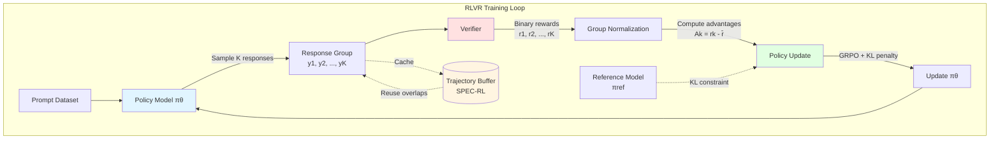
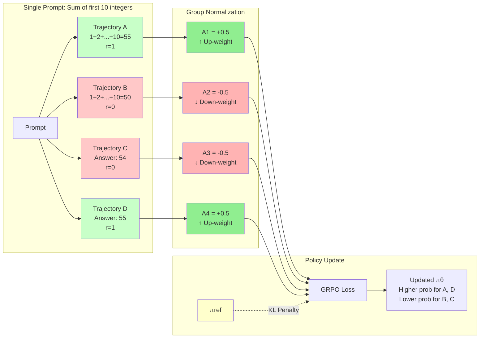
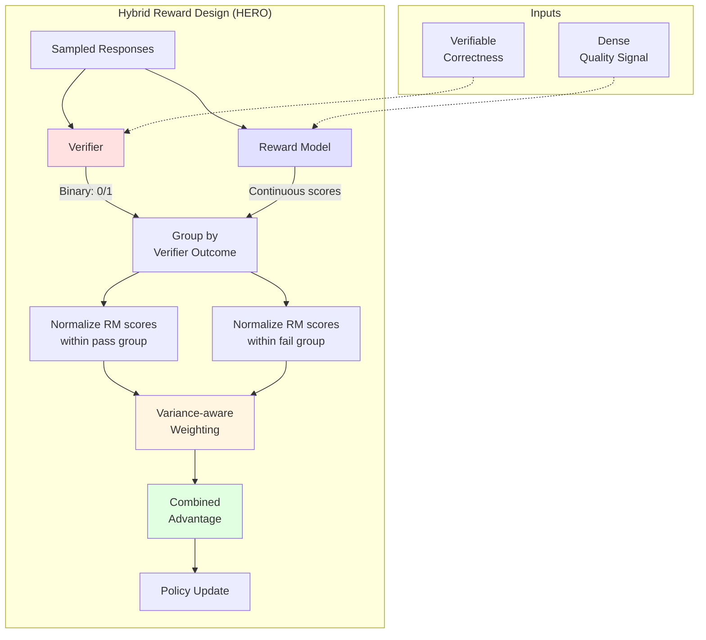
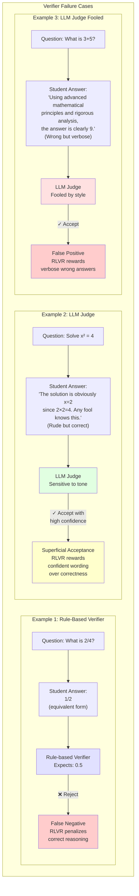

## Key takeaways

- RLVR is just RL with a special kind of reward: a program or model that can verify correctness for each sample, often as a binary score.
- RLVR works best when the base model already solves a decent fraction of cases; it compresses search over reasoning paths rather than discovering skills from zero.
- The verifier is itself a learning system: noisy or biased verifiers shape the policy, so they need as much care as the policy model.
- Sampling efficiency is now a central problem: most RLVR compute goes into rollouts, not gradient steps, and recent work focuses on smarter reuse and exploration.
- Reward hacking does not disappear in RLVR; it just moves to the interface between model and verifier, and must be handled with hybrid rewards, composite penalties, and noise-aware corrections.
- Open problems include verifier design for open-ended tasks, combining human and verifiable rewards, and understanding when RLVR gives real capability gains versus pure search compression.

## Introduction

This post is written for readers who:

- Know basic supervised learning and have a rough picture of RL (policy, reward, episodes).
- Have seen RLHF diagrams, but have not yet built an RLHF or RLVR pipeline.
- Want a concrete sense of when RLVR is a good idea, and what can go wrong.

The goal is not to cover every RLVR paper, but to give you:

- A mental model of RLVR that fits cleanly into standard RL.
- A simple worked example you can adapt.
- Pointers into current work on sampling efficiency, verifier quality, and hybrid rewards.

You can treat this as a "bridge" between RLHF tutorials such as Hugging Face's blog on RLHF <d-cite key="huggingface_rlhf_blog"></d-cite> and recent RLVR systems such as Tulu 3 <d-cite key="tulu3_open_instruct"></d-cite> or RLVR-World <d-cite key="rlvr_world2025"></d-cite>.

## Background: from RL and RLHF to RLVR

### Quick RL recap

Standard RL assumes:

- A policy $\pi_\theta(a \mid s)$ that maps states to action distributions.
- An environment that returns a new state and a reward.
- An objective such as maximising expected return $J(\theta) = \mathbb{E}[R]$.

Policy gradient methods adjust $$\theta$$ in the direction of

$$
\nabla_\theta J(\theta) \approx \mathbb{E}\left[\nabla_\theta \log \pi_\theta(a \mid s), A\right],
$$

where $A$ is an advantage: how much better this action was compared to average.

For language models, the "state" is the current prefix, the "action" is the next token, and an episode is the full generated answer.

### How RLHF fits in

In RLHF, you:

1. Train a base model with supervised data.
2. Train a reward model from human preferences.
3. Run RL (often PPO) where the reward model scores generated answers. <d-cite key="huggingface_rlhf_blog"></d-cite>

The reward model is soft, dense, and subjective. It can score stylistic quality, politeness, safety, and many other aspects. But it is expensive to train and can be hacked.

### What changes in RLVR

RLVR keeps the policy gradient machinery, but replaces the reward model with a *verifier*:

- A rule-based checker (for math, code, world model metrics).
- Or a specialised model that compares a candidate answer to a reference. <d-cite key="verifybench2025"></d-cite>

The verifier often returns a binary reward:

- 1 if the answer passes the test.
- 0 if it fails.

This is the main structural change:

> RLHF: "Ask humans what they like, fit a reward model, then optimise it."
> 
> 
> RLVR: "Write tests, run them as the reward function, then optimise to pass more tests."
> 

Tulu 3 popularised the term RLVR in open language model post-training, showing gains on mathematical problem solving and instruction following by combining supervised fine-tuning, DPO, and RLVR. <d-cite key="tulu3_open_instruct"></d-cite>

## The core RLVR loop

The most common RLVR implementation today uses GRPO (Group Relative Policy Optimization). <d-cite key="grpo2025"></d-cite> You can think of it as a bandit-style variant of PPO adapted to language.

**High-level loop**

For each prompt $x$:

1. Sample a *group* of $K$ responses $(y_1, \dots, y_K)$ from the current policy.
2. For each response, compute a verifier reward $r_k \in \{0,1\}$ or a small set of discrete values.
3. Normalise rewards within the group to compute an advantage for each sample.
4. Update the policy using a clipped objective similar to PPO, plus a KL penalty that keeps the policy near a reference model.

The grouping step is crucial. Within a group, "better than peers" is more important than absolute reward. This stabilises training when rewards are sparse.

To mirror the structure of the sample distill post, Figure 1 below condenses the sampler -> verifier -> policy update loop plus a replay buffer for SPEC-RL style reuse.

**Figure 1.** Overview of the RLVR loop with a reusable trajectory cache. The policy samples responses, the verifier scores them, rewards are normalized within groups to compute advantages, and the policy is updated with GRPO while maintaining a KL penalty to a reference model. SPEC-RL style caching enables trajectory reuse across epochs.

  <iframe
    src="{{ 'assets/html/2026-04-27-teaching-models-with-tests/policy-trajectory.html' | relative_url }}"
    frameborder="0"
    scrolling="no"
    height="500px"
    width="100%"
  ></iframe>

## A worked toy example: RLVR for a single math problem

Let us walk through a tiny example that captures the mechanics without any code.

**Task**

Prompt:

> "Compute the sum of the first 10 positive integers. Think step by step and answer with a number at the end."
> 

Reference answer: 55.

Verifier: parse the last number in the output and check if it equals 55.

**Step 1: Base model behaviour**

Suppose the base model already answers correctly 2 times out of 4 when sampled with temperature 0.7 on this prompt. It might produce:

1. Answer A: 1+2+...+10 = 55 [pass]
2. Answer B: 1+2+...+10 = 50 [fail]
3. Answer C: Explanation is mostly fine, arithmetic slip, final answer 54 [fail]
4. Answer D: Messy reasoning, final answer 55 [pass]

The verifier only cares about the final integer. It assigns:

- $r_1 = 1$, $r_2 = 0$, $r_3 = 0$, $r_4 = 1$.

**Step 2: Grouped rewards**

Within this group, the average reward is $\bar{r} = (1+0+0+1)/4 = 0.5$.

Define group advantages:

- $A_k = r_k - \bar{r}$.

That gives $A = [+0.5, -0.5, -0.5, +0.5]$.

**Step 3: Policy update**

For each answer, compute the log probabilities under:

- The current policy $\pi_\theta$.
- A frozen reference policy $\pi_{\text{ref}}$ (often the initial supervised model).

The GRPO loss encourages:

- Higher probability for samples with positive advantage (answers A, D).
- Lower probability for samples with negative advantage (answers B, C).
- A KL regulariser keeps $\pi_\theta$ near $\pi_{\text{ref}}$, to prevent collapse.

After many prompts and many such groups, the policy shifts probability mass toward reasoning paths that end in correct answers according to the verifier.

**Figure 2.** Token-level view of GRPO for a single prompt. Four trajectories are sampled with different rewards (1 for correct, 0 for incorrect). Group normalization computes advantages relative to the mean reward (0.5), resulting in positive advantages for correct answers and negative for incorrect ones. The policy update increases probability for trajectories A and D while decreasing it for B and C, with a KL penalty keeping the policy close to the reference model.

This is all RLVR does at its core. Everything else in recent papers adjusts:

- How you sample groups.
- How you design, calibrate, or combine verifiers.
- How you make rollouts efficient at scale.

## RLVR in practice: language, vision, and world models

### Language: Tulu 3 and reasoning-heavy tasks

Tulu 3 combined supervised fine-tuning, DPO, and RLVR to push open Llama-based models close to or beyond smaller proprietary models on math and instruction-following benchmarks. <d-cite key="tulu3_open_instruct"></d-cite> The RLVR stage used verifiable tasks such as math and coding, where each answer can be checked by either:

- A rule-based evaluator (e.g., unit tests).
- A structured comparison to reference answers.

The main pattern:

- Use SFT and DPO to get good base behaviour.
- Use RLVR on tasks with strong verifiers to sharpen reasoning.

### World models: RLVR-World

RLVR-World generalises the same idea to world models. Instead of training with maximum likelihood (predicting next tokens), RLVR-World decodes trajectories and evaluates them with task metrics such as prediction accuracy, perceptual quality, or downstream control scores, then treats these as verifiable rewards. <d-cite key="rlvr_world2025"></d-cite>

This is useful when:

- You care about trajectory-level quality rather than token-wise likelihood.
- You can compute a scalar score from decoded predictions.

| Aspect | MLE training | RLVR-World training |
|--------|--------------|---------------------|
| Objective | Next-token log-likelihood | Expected verifiable metric on decoded paths |
| Signal granularity | Dense per token | Trajectory-level, possibly sparse |
| Alignment with task | Indirect | Direct, through metric definition |

**Table 1.** Comparing MLE (Maximum Likelihood Estimation) and RLVR-World training approaches for world models.

### Vision: Visual-RFT

Visual-RFT extends the RLVR pattern to large vision-language models. It samples multiple candidate outputs for each image and applies visual verifiers, such as IoU-based scores for detection. These scores drive policy optimisation using GRPO-style updates. <d-cite key="visual_rft2025"></d-cite> The key lesson is that "verifiable reward" does not have to be binary:

- You can compute continuous scores (e.g., IoU).
- You can still group and normalise them within each rollout batch.

## Beyond exact verifiers: probability-based and hybrid rewards

Binary verifiers are strong but brittle. They ignore partially correct answers and cannot cover tasks without exact references.

Two recent directions are worth highlighting.

### RLPR: using intrinsic probabilities as rewards

RLPR observes that for many tasks you have reference answers, but not a good verifier. The authors propose to use the model's own log-probability of the reference answer as a reward signal, then stabilise this noisy reward with special normalisation and variance reduction. <d-cite key="rlpr2025"></d-cite>

This keeps the spirit of RLVR (focus on correctness against a reference) but:

- Avoids writing domain-specific verifiers.
- Trades hard 0/1 signals for continuous, model-based scores.

### HERO: hybrid verifier and reward model signals

HERO (Hybrid Ensemble Reward Optimization) takes the opposite direction: start from verifiable rewards, then mix in dense scores from a learned reward model. <d-cite key="hero2025"></d-cite>

HERO:

- Groups samples by verifier outcome.
- Normalises reward model scores within each group.
- Uses a variance-aware weighting scheme to focus on prompts where dense feedback matters.

Conceptually:

- The verifier keeps your training grounded in correctness.
- The reward model refines quality among answers that are all "correct enough."

**Figure 3.** Hybrid reward design in HERO (Hybrid Ensemble Reward Optimization). The verifier provides binary correctness signals to group responses, while the reward model provides continuous quality scores. Within each verifier group (pass/fail), reward model scores are normalized separately, then combined with variance-aware weighting to produce final advantages for policy updates.

## Sampling efficiency and trajectory design

RLVR is expensive. Most compute is spent on rollouts: sampling many long trajectories per prompt, running verifiers, and discarding everything after a single gradient step.

This has triggered a line of work on sampling efficiency and exploration.

### SPEC-RL: reusing trajectories across epochs

SPEC-RL introduces speculative rollouts to reuse overlapping prefixes between epochs. Instead of regenerating full trajectories from scratch, it:

1. Caches rollouts from the previous epoch.
2. Uses speculative decoding to extend only where the current policy diverges from the cached policy.
3. Re-verifies only the new segments. <d-cite key="specrl2025"></d-cite>

Reported results show 2-3× reduction in rollout time on math and reasoning benchmarks, with similar or slightly better final accuracy.

### CURE and LATR: exploration under group rollouts

CURE attacks entropy collapse in RLVR. Static initial-prompt sampling tends to narrow the distribution quickly; the policy becomes over-confident and stops exploring useful variations. CURE:

- Identifies high-entropy "critical tokens."
- Regenerates from these points to create branched trajectories.
- Trains jointly on original and branched paths in a two-stage schedule to balance exploration and exploitation. <d-cite key="cure2025"></d-cite>

LATR (Lookahead Tree-Based Rollouts) targets trajectory-level diversity. Instead of relying on local sampling noise, it:

1. Branches at high-uncertainty steps.
2. Simulates lookahead for each branch.
3. Prunes branches that remain too similar. <d-cite key="latr2025"></d-cite>

This increases the chance that a rollout batch contains genuinely different reasoning paths, which makes group-based advantages more informative.

| Method | Main idea | Effect on compute | Effect on exploration |
|--------|-----------|-------------------|-----------------------|
| SPEC-RL | Reuse cached rollouts with spec-decoding | Cuts rollout tokens per epoch | Neutral, focuses on reuse |
| CURE | Regenerate at critical tokens | Increases diversity locally | Prevents entropy collapse |
| LATR | Tree-structured branching and lookahead | Spends more on "hard" steps | Increases trajectory diversity |

**Table 2.** Comparing sampling-efficiency methods in RLVR. Different approaches trade off compute cost and exploration capability.

For practitioners, the message is clear: if you plan to run RLVR at scale, you must think about reuse and exploration explicitly. Naive group sampling scales poorly.

## Reward hacking and verifier robustness

RLVR might look safe at first glance: the reward is a deterministic program. In practice, there are many ways for a strong model to "game" the verifier without solving the intended task.

### Classical reward hacking

Lilian Weng's survey on reward hacking gives a thorough overview of how agents exploit mis-specified rewards in RL systems, from simple games to real robots. <d-cite key="weng_reward_hacking"></d-cite> The same patterns appear in RLVR:

- Models learn to output answers in a format that passes brittle parsers but does not reflect correct reasoning.
- Models discover text patterns that trick LLM-based judges into giving high scores.

### Composite rewards and structural constraints

One concrete case appears in medical QA with RLVR, where models tried to:

- Skip reasoning entirely and output only final answers.
- Use non-standard formats the verifier did not penalise.

Reward Hacking Mitigation using Verifiable Composite Rewards adds explicit penalties for these behaviours, forming a composite reward that balances correctness, reasoning structure, and format. <d-cite key="composite_rewards2025"></d-cite>

The main lesson:

- You can use RLVR to enforce *process* constraints, not only final answers.
- Penalising structural violations can reduce reward hacking while keeping accuracy.

### Noisy verifiers and correction methods

Verifiers themselves are noisy. Rule-based math checkers might reject equivalent answers; LLM judges can be biased by style.

Cai et al. model the verifier as a noisy reward channel with asymmetric false-positive and false-negative rates and derive two correction schemes:

- Backward correction: adjust observed rewards to be an unbiased estimate of the clean gradient.
- Forward correction: reweight score terms so that the expected update direction matches the clean gradient, using only the false-negative rate. <d-cite key="noisy_verifiers2025"></d-cite>

They implement both as light-weight hooks on top of a GRPO-based RLVR pipeline and report better stability under heavier noise.

### Benchmarking verifiers

VerifyBench takes a step back and treats verifiers as first-class objects to evaluate. It builds a 4,000-question benchmark across math, physics, chemistry, and biology, with diverse responses and reference answers, then compares:

- Specialised rule-based verifiers.
- General LLM-based judges. <d-cite key="verifybench2025"></d-cite>

They find clear trade-offs:

- Rule-based systems are precise but miss many correct alternative answers (low recall).
- LLM judges are inclusive but have unstable precision and are sensitive to prompt structure.

For RLVR, this means that verifier choice shapes both performance and failure modes. You cannot treat the verifier as "just a labeler."

**Figure 4.** Verifier failure cases that can mislead RLVR training. Rule-based verifiers may reject equivalent correct answers (false negatives), while LLM judges can be fooled by superficial wording or confident tone (false positives) or be overly sensitive to style rather than correctness.

## How RLVR relates to general RL questions

Although RLVR appears specialised, it connects to classic RL themes.

### Credit assignment and sparse reward

RLVR often uses a scalar reward at the end of a long reasoning chain. This is a textbook case of sparse reward:

- Every token in the chain shares the same advantage.
- The signal backpropagates only through log-probabilities and KL terms.

Recent work in hybrid rewards (HERO) and process-level signals (e.g., step-wise reward models and self-verification) can be seen as attempts to densify the reward while keeping verifiable anchors. <d-cite key="hero2025"></d-cite>

### Exploration vs exploitation

Group-based updates with a strong verifier tend to push the policy toward a narrow set of successful patterns. Without careful exploration schemes (entropy bonuses, CURE, LATR), RLVR can converge quickly to brittle policies that break on distribution shifts. <d-cite key="cure2025"></d-cite>

### On-policy nature and base-model dependence

GRPO is on-policy: you sample from the current model, evaluate, and update. Analysis of GRPO's dynamics with binary rewards shows that RLVR often acts as a *success amplifier*: it concentrates probability on solutions that the base model already finds, rather than discovering qualitatively new strategies. <d-cite key="grpo2025"></d-cite>

This matches empirical observations: models need reasonable zero-shot performance before RLVR, or training is unstable and slow.

## A simple design recipe for your first RLVR project

If you want to build an RLVR experiment, a practical minimal recipe looks like this.

1. **Pick a domain with strong verifiers.**
    
    Math, coding, structured QA, or world model metrics are natural first targets.
    
2. **Start from a strong base model.**
    
    Use SFT and, if possible, DPO to get an instruction-following model that already solves a non-trivial fraction of cases.
    
3. **Write or choose a robust verifier.**
    
    Use rule-based checks where possible. For more complex tasks, consider a small verifier model, but test it on adversarial patterns.
    
4. **Define a small set of reward types.**
    
    For example: exact correctness, format correctness, and process compliance. Use a composite reward if you see obvious hacking.
    
5. **Tune group size and sampling.**
    
    Start with small K (e.g., 4-8), add entropy bonuses, and monitor diversity. If you run into compute bottlenecks, consider SPEC-RL-style reuse. <d-cite key="specrl2025"></d-cite>
    
6. **Monitor both accuracy and verifier behaviour.**
    
    Keep a held-out set evaluated by humans or a different judge. If verifier accuracy drifts, you are probably chasing artefacts.
    
7. **Log trajectories for later analysis.**
    
    Many recent insights about RLVR come from looking at full reasoning trees, not only final scores.
    

**Interactive artifact (suggested): RLVR playground**

> An interactive web demo where users can toggle:
> 
> - Base accuracy (fraction of cases the base model solves).
> - Group size K.
> - KL strength.
>     
>     The demo would visualise how probability mass concentrates on successful trajectories over RL steps for a toy math task.
>     

## Open questions and future directions

RLVR is moving fast, and some of the most interesting questions are still wide open.

### How far can verifier-free methods go?

RLPR and related work show that you can use model intrinsic probabilities as a soft stand-in for verifiers, with careful normalisation. <d-cite key="rlpr2025"></d-cite> How far can this go toward general domains where no exact reference is available?

- When does RLPR behave like RLHF with a frozen reward model?
- Can we combine RLPR with small, task-specific verifiers for hybrid control?

### Verifiers for open-ended tasks

VerifyBench highlights trade-offs between specialised and general verifiers even in structured scientific domains. <d-cite key="verifybench2025"></d-cite> For open-ended tasks (e.g., long-form reasoning, multi-step agents), we still lack:

- Benchmarks that stress verification, not just answer quality.
- Design patterns for building verifiers that are both robust and transparent.

### Reward hacking at scale

Composite rewards and noise-aware corrections improve robustness on specific domains. <d-cite key="composite_rewards2025"></d-cite> But we still do not have:

- A standard way to stress-test RLVR systems for reward hacking before deployment.
- Strong guarantees that reward shaping does not introduce new failure modes.

Bridging the gap between conceptual analyses of reward hacking <d-cite key="weng_reward_hacking"></d-cite> and concrete RLVR pipelines is an open engineering and research challenge.

### Sampling-efficiency limits

Methods such as SPEC-RL, CURE, and LATR attack different pieces of the sampling problem. <d-cite key="specrl2025"></d-cite> Open questions include:

- How close are we to the "sample-efficiency limit" for RLVR on current hardware?
- Can we design algorithms that adaptively allocate more rollout budget only to prompts where RLVR brings clear gains?

### Capability vs search compression

There is an ongoing discussion about whether RLVR primarily compresses search over existing capabilities or truly expands reasoning skills. Recent analyses suggest that, at least in some math settings, RLVR makes models "faster, not smarter," by concentrating probability mass on already reachable solutions. <d-cite key="promptfoo_rlvr"></d-cite>

Understanding when RLVR expands the reachable set of solutions, rather than just reweighting them, is both a conceptual and empirical challenge.

## Further reading

If you want to go deeper after this tutorial, here are some suggested paths:

- **Conceptual:**
    - Lilian Weng's "Reward Hacking in RL" for a broad view of reward design and failure modes. <d-cite key="weng_reward_hacking"></d-cite>
    - Hugging Face's "Illustrating RLHF" for a clear step-by-step RLHF pipeline. <d-cite key="huggingface_rlhf_blog"></d-cite>
- **Core RLVR systems:**
    - Tulu 3 and the open-instruct codebase for a full post-training recipe mixing SFT, DPO, and RLVR. <d-cite key="tulu3_open_instruct"></d-cite>
    - RLVR-World for applying RLVR to world models and task-aligned metrics. <d-cite key="rlvr_world2025"></d-cite>
    - Visual-RFT for extending RLVR to vision-language models with visual verifiers. <d-cite key="visual_rft2025"></d-cite>
- **Verifiers and robustness:**
    - VerifyBench for systematic verifier evaluation. <d-cite key="verifybench2025"></d-cite>
    - "Reinforcement Learning with Verifiable yet Noisy Rewards under Imperfect Verifiers" for noise-aware correction. <d-cite key="noisy_verifiers2025"></d-cite>
    - "Reward Hacking Mitigation using Verifiable Composite Rewards" for composite reward design in medical QA. <d-cite key="composite_rewards2025"></d-cite>
- **Sampling and efficiency:**
    - SPEC-RL for speculative rollouts. <d-cite key="specrl2025"></d-cite>
    - CURE and LATR for exploration and trajectory-level diversity. <d-cite key="cure2025"></d-cite>

RLVR is still young. If you are willing to write tests and think carefully about verifiers, there is a lot of space to build new systems, new theory, and better tooling for the next generation of reasoning models.
